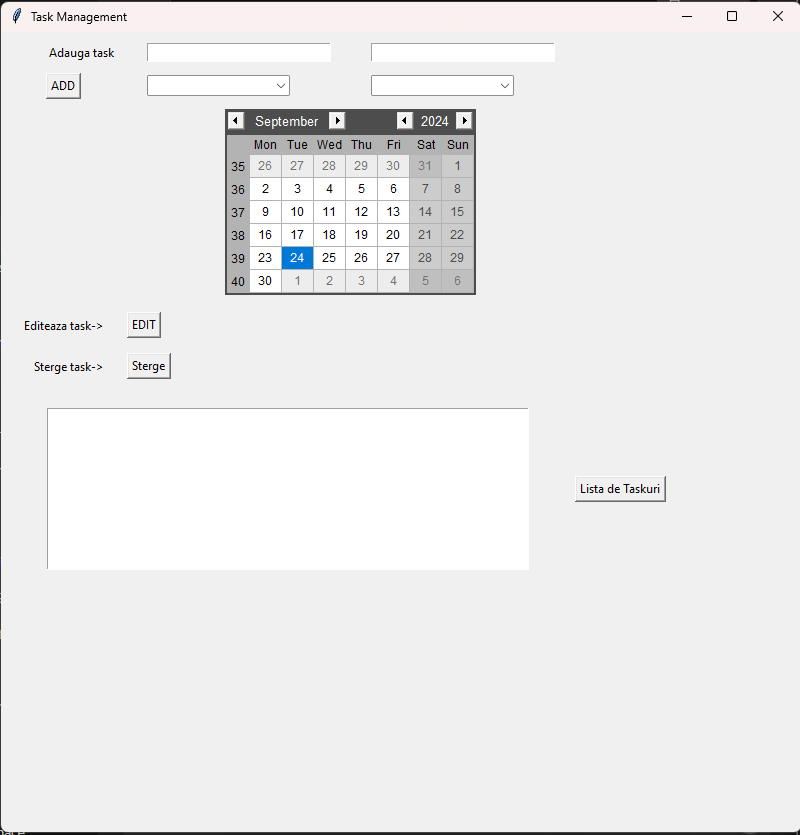

# Task Management System

## Overview
This project is a task management system built using Python, Tkinter, and pandas. It allows users to add, edit, delete, and filter tasks, with data stored in CSV format. The graphical user interface is developed using Tkinter, providing a user-friendly way to interact with tasks.

## Features
- Add new tasks with priority, description, and deadlines.
- Edit existing tasks and update their status.
- Delete tasks and automatically refresh the interface.
- Filter tasks by status and priority.
- Data persistence using CSV files and pandas DataFrame for manipulation.

## Technologies Used
- Python
- pandas
- Tkinter
- CSV

## How to Run
1. Clone this repository.
2. Install the required libraries using command: pip install pandas tkcalendar
3. Run the `main.py` file to launch the application.

## Screenshots

## Future Improvements
- Implement database storage (SQLite).
- Add support for exporting tasks to JSON.